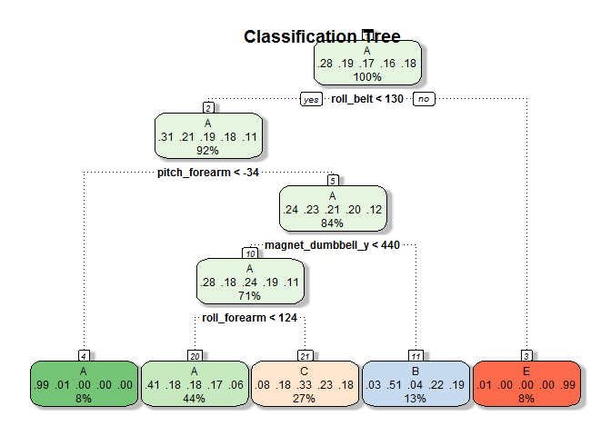
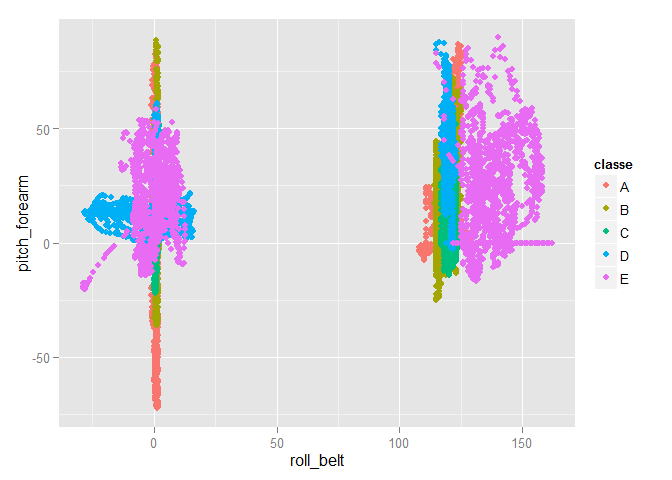

# Assignment

Prepare for model building
================================
First download the data.

```r
library(caret)
```

```
## Warning: package 'caret' was built under R version 3.1.3
```

```
## Loading required package: lattice
## Loading required package: ggplot2
```

```
## Warning: package 'ggplot2' was built under R version 3.1.2
```

```r
train<-read.csv("./training.csv",header=T)
testing<-read.csv("./testing.csv",header=T)
training<-train[,c(6:11,37:49,60:68,84:86,102,113:124,140,151:160)]
```
The original dataset training has 19622 obervations and 160 variables including the one we are predicting for----variable "classe". We filter the first five colunms and the colunms with missing data to create new dataset "traning".


```r
table(training$classe)
```

```
## 
##    A    B    C    D    E 
## 5580 3797 3422 3216 3607
```
classe is a factor varibale, and there are five levels of classe.


Model building
=================
#classification tree

```r
modfit<-train(classe~.,data=training,method="rpart")#12min
```

```
## Loading required package: rpart
```

```r
modfit$finalModel
```

```
## n= 19622 
## 
## node), split, n, loss, yval, (yprob)
##       * denotes terminal node
## 
##  1) root 19622 14042 A (0.28 0.19 0.17 0.16 0.18)  
##    2) roll_belt< 130.5 17977 12411 A (0.31 0.21 0.19 0.18 0.11)  
##      4) pitch_forearm< -33.95 1578    10 A (0.99 0.0063 0 0 0) *
##      5) pitch_forearm>=-33.95 16399 12401 A (0.24 0.23 0.21 0.2 0.12)  
##       10) magnet_dumbbell_y< 439.5 13870  9953 A (0.28 0.18 0.24 0.19 0.11)  
##         20) roll_forearm< 123.5 8643  5131 A (0.41 0.18 0.18 0.17 0.061) *
##         21) roll_forearm>=123.5 5227  3500 C (0.077 0.18 0.33 0.23 0.18) *
##       11) magnet_dumbbell_y>=439.5 2529  1243 B (0.032 0.51 0.043 0.22 0.19) *
##    3) roll_belt>=130.5 1645    14 E (0.0085 0 0 0 0.99) *
```
Above is the final model.And we can plot the tree below.


```r
library(rattle)
```

```
## Warning: package 'rattle' was built under R version 3.1.3
```

```
## Rattle: A free graphical interface for data mining with R.
## XXXX 3.4.1 Copyright (c) 2006-2014 Togaware Pty Ltd.
## 键入'rattle()'去轻摇、晃动、翻滚你的数据。
```

```r
fancyRpartPlot(modfit$finalModel,main="Classification Tree",sub="")
```

 


```r
modfit$results[1,]
```

```
##           cp Accuracy    Kappa AccuracySD    KappaSD
## 1 0.03891896 0.550744 0.423476 0.03365901 0.04875847
```
The accuracy of the final model is 0.55 on training data,and the kappa value equals 0.42.


```r
library(ggplot2)
qplot(roll_belt,pitch_forearm,colour=classe,data=training)
```

 


